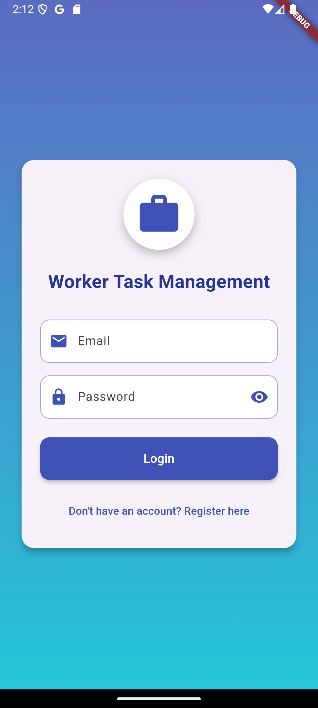
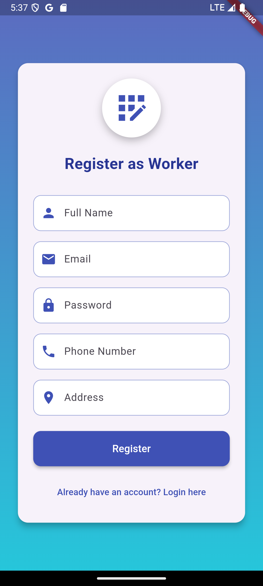
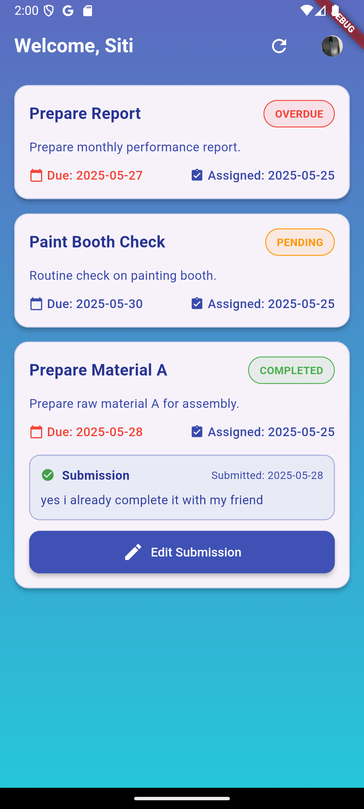
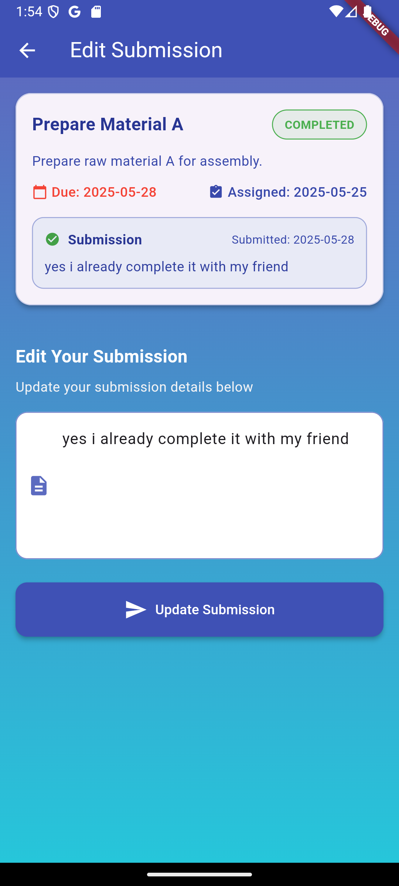
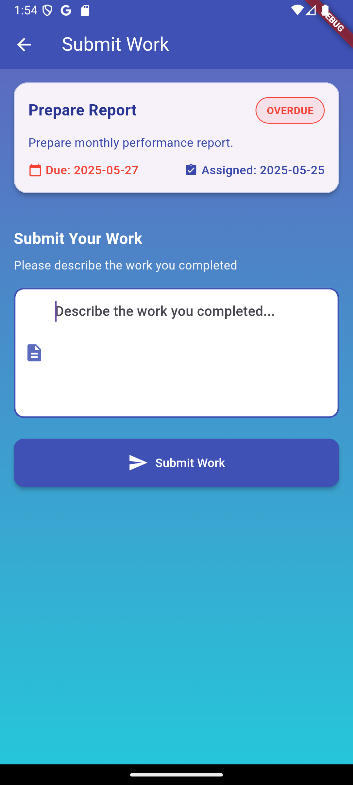
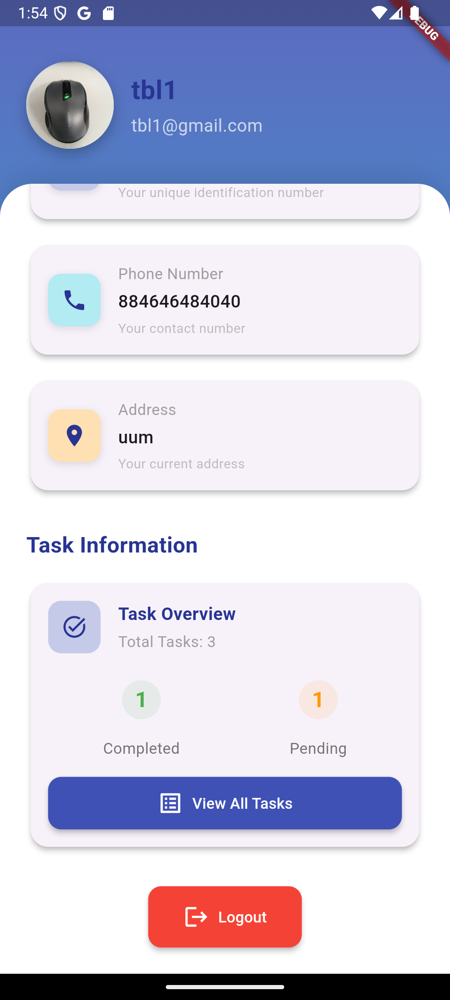

# Workers Tasks Management System

A comprehensive Flutter application for managing worker tasks and profiles with enhanced personal information management.

## ✨ Features

### 🔐 User Authentication
- **Worker Registration** with comprehensive form validation
- **Secure Worker Login** with session management
- **Password Security** with SHA1 hashing
- **Session Persistence** for seamless user experience

### 👤 Enhanced Profile Management
- **Comprehensive Personal Information**
  - Basic details (name, email, phone, address)
  - Personal information (date of birth, gender, nationality)
  - Emergency contact details
  - Detailed address information (city, state, postal code, country)
- **Profile Completion Tracking** with progress indicators
- **Real-time Data Synchronization** with automatic refresh
- **Modern UI Design** with organized sections and visual hierarchy
- **Profile Image Management** with upload functionality
- **Task Statistics Overview** with visual indicators

### 📋 Advanced Task Management
- **Task Assignment** and tracking system
- **Work Submission** with edit capabilities
- **Status Management** (pending, completed, overdue)
- **Automatic Status Updates** based on due dates
- **Task Statistics** with color-coded indicators
- **Pull-to-refresh** functionality
- **Real-time Updates** and notifications

### 📊 Analytics & Reporting
- **Profile Completion Percentage** with motivational messages
- **Task Performance Metrics** (completed, pending, overdue)
- **Visual Progress Indicators** with color coding
- **Statistical Overview** for better productivity tracking

## Development

The application is built using:
- Flutter
- PHP (Backend)
- MySQL (Database)

## 📁 File Structure

```
lib/
├── config/
│   └── app_config.dart           # Configuration settings & API endpoints
├── models/
│   └── work.dart                 # Work model with enhanced data handling
│   └── worker.dart               # Comprehensive worker model
├── screens/
│   ├── login_screen.dart         # Enhanced login with validation
│   ├── registration_screen.dart  # Registration with profile image
│   ├── profile_screen.dart       # Enhanced profile with personal info
│   ├── task_list_screen.dart     # Task management with status tracking
│   └── submit_work_screen.dart   # Work submission interface
└── main.dart                     # Application entry point

api/
├── db_connection.php             # Database connection configuration
├── login_worker.php              # Worker authentication endpoint
├── register_worker.php           # Worker registration endpoint
├── get_profile.php               # Enhanced profile data retrieval
├── update_profile.php            # Comprehensive profile updates
├── get_works.php                 # Task retrieval with status management
├── submit_work.php               # Work submission handling
├── edit_submission.php           # Submission editing functionality
└── add_personal_info_fields.sql  # Database schema updates
```

## 🗄️ Enhanced Database Schema

### Tables

#### 1. `tbl_workers` (Enhanced with Personal Information)
**Basic Information:**
- `id` (Primary Key)
- `full_name`
- `email` (Unique)
- `password` (SHA1 hashed)
- `phone`
- `address`
- `profile_image`
- `created_at`

**Personal Information Fields (NEW):**
- `date_of_birth` (DATE) - Worker's date of birth
- `gender` (ENUM: 'male', 'female', 'other', 'prefer_not_to_say')
- `nationality` (VARCHAR) - Default: 'Malaysian'

**Emergency Contact Information (NEW):**
- `emergency_contact_name` (VARCHAR) - Emergency contact full name
- `emergency_contact_phone` (VARCHAR) - Emergency contact phone number
- `emergency_contact_relationship` (VARCHAR) - Relationship to worker

**Address Details (NEW):**
- `city` (VARCHAR) - Worker's city
- `state` (VARCHAR) - Worker's state/province
- `postal_code` (VARCHAR) - ZIP/postal code
- `country` (VARCHAR) - Default: 'Malaysia'

**System Fields:**
- `updated_at` (TIMESTAMP) - Auto-updated on changes

#### 2. `tbl_works`
- `id` (Primary Key)
- `title`
- `description`
- `assigned_to` (Foreign Key to tbl_workers)
- `date_assigned`
- `due_date`
- `status` (pending/completed/overdue)

#### 3. `tbl_submissions`
- `id` (Primary Key)
- `work_id` (Foreign Key to tbl_works)
- `worker_id` (Foreign Key to tbl_workers)
- `submission_text`
- `submitted_at`

### 🔧 Database Updates

To add the new personal information fields to an existing database:

```sql
-- Run this SQL script to add personal information fields
source api/add_personal_info_fields.sql
```

The script includes:
- ✅ **Safe field additions** with IF NOT EXISTS logic
- ✅ **Performance indexes** for better query optimization
- ✅ **Default values** for smooth migration
- ✅ **Data integrity** with proper constraints

## Features in Detail

### User Authentication
- **Login Screen**
  - Email validation
  - Password visibility toggle
  - Error handling with user-friendly messages
  - Session persistence
  - Automatic login for existing sessions

- **Registration Screen**
  - Form validation for all fields
  - Optional profile picture upload
  - Password visibility toggle
  - Phone number validation
  - Multiline address input
  - Success overlay message

### Task Management
- **Task List Screen**
  - View all assigned tasks
  - Task status indicators with color coding
    - Green: Completed
    - Orange: Pending
    - Red: Overdue
  - Due date tracking
  - Submission management
  - Edit submission functionality
  - Pull-to-refresh
  - Profile quick access
  - Automatic overdue status update

- **Submit Work Screen**
  - Submit new work
  - Edit existing submissions
  - Success feedback
  - Form validation
  - Consistent task card UI
  - Status color indicators

### 👤 Enhanced Profile Management

#### **🎯 Integrated Edit Design (Latest Update)**
- **Streamlined Interface** - Edit functionality integrated with profile completion card
- **Contextual Actions** - Edit button appears with completion information for intuitive workflow
- **Smart Visual Feedback** - Button changes color and text based on editing state
- **Space-Efficient Design** - Maximum functionality in minimal space

#### **📊 Profile Completion System**
- **Real-time Progress Tracking** - Dynamic completion percentage calculation
- **Color-coded Progress Indicators**:
  - 🟢 **Green (80%+)**: Excellent completion
  - 🟠 **Orange (50-79%)**: Good progress
  - 🔴 **Red (<50%)**: Needs attention
- **Motivational Messages** - Contextual guidance based on completion level
- **Visual Progress Bar** - Clear completion status at a glance

#### **✏️ Integrated Edit Functionality**
- **One-Click Editing** - Edit button integrated into completion card
- **State-Aware Design** - Button appearance changes based on mode:
  - **Edit Mode**: Blue gradient with "Edit" text and edit icon
  - **Cancel Mode**: Red gradient with "Cancel" text and close icon
- **Seamless Transitions** - Smooth switching between view and edit modes
- **Form Reset on Cancel** - Automatic form restoration when canceling edits

#### **📞 Interactive Phone Number Features (NEW)**
- **Direct Calling** - One-tap phone dialing through device's phone app
- **Copy to Clipboard** - Quick copy functionality with confirmation feedback
- **Enhanced Phone Cards** - Professional design with call and copy buttons
- **Smart Detection** - Interactive features only for valid phone numbers
- **Emergency Contact Support** - Special handling for emergency contact numbers
- **Cross-Platform Support** - Works on Android, iOS, and other platforms

#### **📋 Comprehensive Information Management**
- **Basic Information** - Name, email, phone, address
- **Personal Details** - Date of birth with age calculation, gender, nationality
- **Emergency Contact** - Name, phone, relationship for safety compliance
- **Address Details** - City, state, postal code, country for structured location data

#### **🎨 Modern UI Features**
- **Organized Information Sections** with color-coded categories
- **Smart Section Display** - only shows sections with data
- **Professional Card Design** - Modern gradients and shadows
- **Mobile-Optimized Layout** - Touch-friendly design with proper spacing
- **Status Indicators** - Online status and verification badges

### Security Features
- Password hashing using SHA1
- Session management using SharedPreferences
- Form validation on both client and server side
- Secure file upload handling
- Input sanitization
- Confirmation dialogs for important actions


## 🔗 API Endpoints

The application uses the following enhanced API endpoints:

### Authentication
- **Login**: `$baseUrl/api/login_worker.php`
- **Registration**: `$baseUrl/api/register_worker.php`

### Profile Management
- **Get Profile**: `$baseUrl/api/get_profile.php` - Retrieves comprehensive worker profile
- **Update Profile**: `$baseUrl/api/update_profile.php` - Updates all profile information including personal details

### Task Management
- **Get Works**: `$baseUrl/api/get_works.php` - Retrieves assigned tasks with status
- **Submit Work**: `$baseUrl/api/submit_work.php` - Handles work submissions
- **Edit Submission**: `$baseUrl/api/edit_submission.php` - Allows submission modifications
- **Get Submissions**: `$baseUrl/api/get_submissions.php` - Retrieves submission history

### Enhanced Features
- **Comprehensive Data Handling** - All endpoints support the new personal information fields
- **Error Handling** - Robust error responses with detailed messages
- **Data Validation** - Server-side validation for all inputs
- **Security** - Input sanitization and SQL injection prevention

## API Configuration

The application uses a centralized configuration system located in `lib/config/app_config.dart`. This makes it easy to modify the base URL and API endpoints across the application.

### Changing the IP Address

To change the IP address or base URL of the application:

1. Open  [/lib/config/app_config.dart](/lib/config/app_config.dart)
2. Locate the `baseUrl` constant:
```dart
static const String baseUrl = 'http://10.0.2.2';
```
3. Update the IP address to your desired value.

For different environments:
- **Android Emulator**: Use `10.0.2.2`
- **Physical Android Device**: Use your computer's local IP address
- **iOS Simulator**: Use `localhost` or `127.0.0.1`
- **Production**: Use your actual server domain/IP

## Getting Started

### Prerequisites

- Flutter SDK (latest version)
- Dart SDK (latest version)
- Android Studio / VS Code
- XAMPP (for local server)

### Installation

1. Clone the repository:
```bash
git clone https://github.com/yt02/task_management_system_flutter.git
```

2. Navigate to the project directory:
```bash
cd task_management_system_flutter
```

3. Install dependencies:
```bash
flutter pub get
```

**Note**: The app now includes enhanced phone functionality with the following dependencies:
- `url_launcher: ^6.2.4` - For direct phone calling functionality
- `flutter/services` - For clipboard copy functionality (built-in)

4. Set up the local server:
   - Install XAMPP
   - Place the `api` folder in the htdocs directory
   - Start Apache and MySQL services

5. Set up the database:
   - Open phpMyAdmin
   - Create a new database named `workers_tasks_db`
   - Import the base database: [/api/workers_tasks_db.sql](/api/workers_tasks_db.sql)
   - **Add personal information fields**: Run [/api/add_personal_info_fields.sql](/api/add_personal_info_fields.sql)

6. Configure the application:
   - Update the IP address in [/lib/config/app_config.dart](/lib/config/app_config.dart)
   - Ensure XAMPP services are running

7. Run the application:
```bash
flutter run
```

## 🆕 Recent Updates & Enhancements

### ✨ Profile System Enhancement (Latest)
- **🎯 Comprehensive Personal Information Management**
  - Added 10 new personal information fields
  - Enhanced database schema with proper indexing
  - Implemented profile completion tracking system

- **🎨 Modern UI/UX Design**
  - Redesigned profile interface with organized sections
  - Added progress indicators and completion tracking
  - Implemented color-coded information categories
  - Enhanced visual hierarchy and user experience

- **🔄 Real-time Data Synchronization**
  - Fixed profile data refresh issues
  - Implemented automatic data fetching on page visits
  - Added smart refresh logic to prevent conflicts
  - Ensured UI always reflects database state

- **📊 Advanced Features**
  - Profile completion percentage calculation
  - Motivational completion messages
  - Smart section display (only shows sections with data)
  - Enhanced form validation and error handling

### 🔧 Technical Improvements
- **Database Enhancements**
  - Added personal information fields with proper constraints
  - Implemented performance indexes for better queries
  - Safe migration scripts with IF NOT EXISTS logic

- **API Enhancements**
  - Enhanced get_profile.php and update_profile.php
  - Improved error handling and data validation
  - Better response formatting and type consistency

- **Flutter Improvements**
  - Created comprehensive Worker model
  - Enhanced state management and data flow
  - Improved error handling and user feedback
  - Added automatic data refresh mechanisms

## Screenshots

| Login Page | Register Page | Task List Page |
|------------|---------------|----------------|
|  |  |  | 

| Edit Submission Page | Submit Work Page  | Profile Page  |
|----------------------|--------------------|-----------------------|
|  |  |  |

## 🎯 Key Features & Benefits

### For Workers
- ✅ **Complete Profile Management** - Comprehensive personal information tracking
- ✅ **Progress Tracking** - Visual completion indicators with motivational messages
- ✅ **Professional Appearance** - Modern, organized interface design
- ✅ **Data Security** - Secure authentication and data handling
- ✅ **Real-time Updates** - Always see the latest information
- ✅ **Emergency Contact Safety** - Important contact information for workplace security

### For Supervisors/Administrators
- ✅ **Comprehensive Worker Profiles** - Complete view of worker information
- ✅ **Profile Completion Tracking** - Monitor which workers have complete profiles
- ✅ **Emergency Contact Access** - Quick access to emergency information
- ✅ **Professional Data Management** - Organized, structured information display
- ✅ **Task Performance Analytics** - Visual task completion statistics

### For Organizations
- ✅ **Enhanced Compliance** - Complete worker information for regulatory requirements
- ✅ **Better Safety Management** - Emergency contact information readily available
- ✅ **Professional System** - Modern, scalable worker management platform
- ✅ **Data Integrity** - Consistent, validated information across the system
- ✅ **Improved Productivity** - Streamlined task and profile management

## 📖 Usage Instructions

### 🎯 Profile Page - Integrated Edit Design

#### **Accessing Your Profile**
1. **Login** to your worker account
2. **Navigate** to the Profile tab in the bottom navigation
3. **View** your enhanced profile interface with completion tracking

#### **Understanding the Profile Interface**

##### **1. Enhanced Profile Header**
- **Profile Picture** - Your avatar with online status indicator (green dot)
- **Basic Info** - Name, email, and worker ID displayed compactly
- **Status Badges** - Active worker status and verification indicators

##### **2. Profile Completion Card (Main Feature)**
```
┌─────────────────────────────────────────┐
│  📊 Profile Completion        [Edit]    │
│  75% Complete                           │
│  ████████░░ 75%                         │
│  "Great progress! Keep going"           │
└─────────────────────────────────────────┘
```

**Features:**
- **Completion Percentage** - Real-time calculation based on filled fields
- **Progress Bar** - Visual representation of completion status
- **Motivational Messages** - Contextual guidance based on your progress
- **Integrated Edit Button** - One-click access to edit mode

##### **3. Information Sections**
- **Basic Information** - Core worker details
- **Personal Information** - Personal details (if provided)
- **Emergency Contact** - Emergency contact info (if provided)
- **Address Details** - Detailed location information (if provided)
- **Task Statistics** - Your work performance overview
- **Account Actions** - Logout and account management

#### **🖊️ Using the Integrated Edit Functionality**

##### **Entering Edit Mode**
1. **Locate** the profile completion card at the top
2. **Tap** the blue "Edit" button on the right side
3. **Observe** the button changes to red "Cancel" mode
4. **Scroll down** to see the edit form appear

##### **Edit Mode Features**
- **Comprehensive Form** - All profile fields available for editing
- **Section Organization** - Fields grouped by category:
  - Basic Information (Name, Email, Phone, Address)
  - Personal Information (Date of Birth, Gender, Nationality)
  - Emergency Contact (Name, Phone, Relationship)
  - Address Details (City, State, Postal Code, Country)
- **Form Validation** - Real-time validation with helpful error messages
- **Date Picker** - Easy date selection for date of birth
- **Dropdown Menus** - Gender selection with inclusive options

##### **Saving Changes**
1. **Fill in** the desired information in the form fields
2. **Scroll down** to find the action buttons
3. **Tap "Save Changes"** to update your profile
4. **Wait** for the success confirmation
5. **Automatic return** to view mode with updated information

##### **Canceling Edits**
1. **Tap** the red "Cancel" button in the completion card
2. **Confirm** if prompted (unsaved changes will be lost)
3. **Automatic return** to view mode
4. **Form reset** - all changes are discarded

#### **📊 Profile Completion System**

##### **Completion Calculation**
Your profile completion is calculated based on 8 key fields:
- ✅ Full Name
- ✅ Email Address
- ✅ Phone Number
- ✅ Address
- ✅ Date of Birth
- ✅ Gender
- ✅ Nationality
- ✅ Emergency Contact Name

##### **Completion Levels & Messages**
- **90%+ (Excellent)**: "Excellent! Your profile is almost complete."
- **70-89% (Great)**: "Great progress! Just a few more details needed."
- **50-69% (Good)**: "Good start! Keep adding more information."
- **<50% (Needs Work)**: "Let's complete your profile for better visibility."

##### **Visual Indicators**
- **Green Progress** (80%+): Excellent completion level
- **Orange Progress** (50-79%): Good progress, room for improvement
- **Red Progress** (<50%): Needs attention and more information

#### **💡 Best Practices**

##### **For Optimal Profile Completion**
1. **Start with Basic Info** - Ensure name, email, phone are accurate
2. **Add Personal Details** - Date of birth, gender, nationality
3. **Include Emergency Contact** - Important for workplace safety
4. **Complete Address Details** - City, state, postal code for full location info
5. **Regular Updates** - Keep information current and accurate

##### **Using the Edit Feature Effectively**
1. **Plan Your Updates** - Gather all information before entering edit mode
2. **Use Validation Feedback** - Pay attention to error messages for guidance
3. **Save Frequently** - Don't lose work by navigating away without saving
4. **Review Before Saving** - Double-check information for accuracy

#### **📞 Using Interactive Phone Numbers**

##### **Making Phone Calls**
1. **Locate** the phone number card in your profile
2. **Tap** the green "Call" button with phone icon
3. **Confirm** the call in your device's phone dialer
4. **Complete** the call as normal

##### **Copying Phone Numbers**
1. **Find** any phone number card (main phone or emergency contact)
2. **Tap** the blue "Copy" button with copy icon
3. **See** the green confirmation message
4. **Paste** the number wherever needed (messages, contacts, etc.)

##### **Phone Number Card Features**
```
┌─────────────────────────────────────────┐
│  📞 Phone Number                        │
│  +1 (555) 123-4567                     │
│  Your contact number                    │
│  ┌─────────┐  ┌─────────┐              │
│  │ 📞 Call │  │ 📋 Copy │              │
│  └─────────┘  └─────────┘              │
└─────────────────────────────────────────┘
```

**Available for:**
- ✅ **Main Phone Number** - Your primary contact number
- ✅ **Emergency Contact Phone** - Emergency contact's phone number
- ✅ **Smart Display** - Only shows interactive buttons for valid numbers

#### **🔄 Data Synchronization**
- **Real-time Updates** - Changes are immediately reflected in the interface
- **Automatic Refresh** - Profile data refreshes when returning from other screens
- **Completion Recalculation** - Progress percentage updates automatically
- **Consistent State** - UI always reflects the current database state

### 🚀 Getting Started with Enhanced Features

#### **Quick Start Guide**
1. **Login** to your worker account
2. **Navigate** to the Profile section
3. **Check** your completion percentage in the completion card
4. **Tap "Edit"** to add missing information
5. **Fill in** the form sections as needed
6. **Save changes** to update your profile
7. **Achieve 100%** completion for optimal profile visibility

#### **Personal Information Management**
- **Basic Information**: Core worker details (name, email, phone, address)
- **Personal Details**: Personal information (date of birth, gender, nationality)
- **Emergency Contact**: Safety contact person for emergencies
- **Address Details**: Detailed location information for records

#### **Task Management**
- **View Tasks** with color-coded status indicators
- **Submit Work** with comprehensive forms
- **Track Progress** with visual statistics
- **Edit Submissions** when needed

## 📈 System Requirements

### Client Side (Flutter App)
- Flutter SDK 3.0+
- Dart SDK 2.17+
- Android 5.0+ / iOS 11.0+
- Internet connection for API communication

### Server Side (PHP Backend)
- PHP 7.4+
- MySQL 5.7+
- Apache/Nginx web server
- XAMPP (for local development)

## 🔧 Troubleshooting

### Profile Page Issues

#### **Edit Button Not Working**
- **Check Internet Connection** - Ensure stable network connectivity
- **Restart App** - Close and reopen the application
- **Re-login** - Logout and login again to refresh session
- **Clear Cache** - Clear app data if issues persist

#### **Profile Data Not Updating**
- **Verify Form Completion** - Ensure all required fields are filled
- **Check Validation Messages** - Address any form validation errors
- **Wait for Confirmation** - Allow time for server response
- **Refresh Profile** - Navigate away and return to profile page

#### **Completion Percentage Not Updating**
- **Save Changes First** - Ensure you've saved your profile updates
- **Refresh Page** - Navigate to another tab and back to profile
- **Check All Fields** - Verify all 8 tracked fields are completed
- **Restart App** - Close and reopen if percentage seems stuck

#### **Form Validation Errors**
- **Email Format** - Ensure email contains @ symbol and valid format
- **Phone Number** - Use valid phone number format
- **Date of Birth** - Select date using the date picker
- **Required Fields** - Fill all fields marked as required

#### **Phone Functionality Issues**
- **Call Button Not Working** - Ensure device has phone calling capability
- **Phone App Not Opening** - Check if default phone app is properly configured
- **Copy Not Working** - Verify clipboard permissions (usually automatic)
- **Invalid Phone Number** - Ensure phone number is in valid format
- **No Interactive Buttons** - Phone cards only show buttons for valid numbers

### General App Issues

#### **Login Problems**
- **Check Credentials** - Verify email and password are correct
- **Network Connection** - Ensure stable internet connectivity
- **Server Status** - Verify XAMPP services are running (for local setup)
- **Clear App Data** - Reset app if login issues persist

#### **Data Not Loading**
- **Internet Connection** - Check network connectivity
- **Server Configuration** - Verify API endpoints in app_config.dart
- **Database Connection** - Ensure MySQL service is running
- **API Response** - Check server logs for error messages

### Server Setup Issues

#### **API Not Responding**
- **XAMPP Services** - Ensure Apache and MySQL are running
- **Port Configuration** - Check if ports 80 and 3306 are available
- **File Permissions** - Verify API files have proper permissions
- **Database Connection** - Check db_connection.php configuration

#### **Database Errors**
- **Table Structure** - Ensure all required tables exist
- **Personal Info Fields** - Run add_personal_info_fields.sql if needed
- **Data Types** - Verify field types match expected formats
- **Indexes** - Ensure proper database indexes are created

## 🔒 Security Features

- **Password Hashing** - SHA1 encryption for secure password storage
- **Session Management** - Secure session handling with SharedPreferences
- **Input Validation** - Comprehensive validation on both client and server
- **SQL Injection Prevention** - Prepared statements for database queries
- **Data Sanitization** - Input cleaning and validation
- **Secure File Upload** - Safe profile image handling
- **Form Security** - Client and server-side validation for all profile fields
- **Session Timeout** - Automatic logout for security

## 🎯 Key Benefits of Integrated Edit Design

### **For Users (Workers)**
- ✅ **Intuitive Workflow** - Edit function appears naturally with completion information
- ✅ **Reduced Cognitive Load** - One place to check progress and edit profile
- ✅ **Clear Visual Feedback** - Button states clearly indicate current mode
- ✅ **Streamlined Interface** - Fewer UI elements to navigate and understand
- ✅ **Professional Experience** - Modern, polished interface suitable for workplace use

### **For Administrators**
- ✅ **Better User Adoption** - Intuitive design encourages profile completion
- ✅ **Higher Completion Rates** - Integrated edit functionality reduces barriers
- ✅ **Cleaner Interface** - Professional appearance suitable for business environments
- ✅ **Easier Support** - Simplified interface reduces user confusion and support requests

### **For Developers**
- ✅ **Cleaner Codebase** - Integrated design reduces component complexity
- ✅ **Better Maintainability** - Related functionality grouped together
- ✅ **Consistent State Management** - Single edit state controls entire interface
- ✅ **Reduced Bug Surface** - Fewer components means fewer potential issues

## 🎉 Conclusion

The Workers Tasks Management System has evolved into a comprehensive platform that provides:

### **🎯 Integrated Profile Management**
- **Streamlined Edit Functionality** - Edit button integrated with completion tracking
- **Professional Interface Design** - Modern, intuitive user experience
- **Real-time Progress Tracking** - Dynamic completion percentage with motivational guidance
- **Comprehensive Information Management** - Complete worker profile system

### **🚀 Advanced Features**
- **Smart Visual Feedback** - Context-aware UI elements that adapt to user actions
- **Mobile-Optimized Design** - Touch-friendly interface with proper spacing
- **Real-time Data Synchronization** - Ensuring information accuracy across the system
- **Robust Security** - Comprehensive validation and secure data handling


