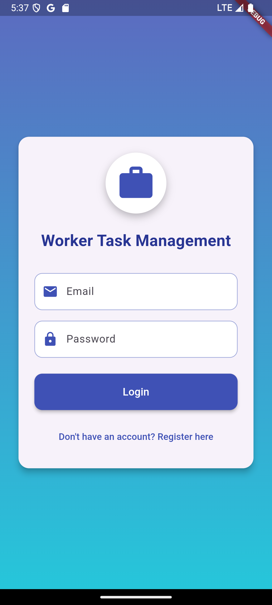
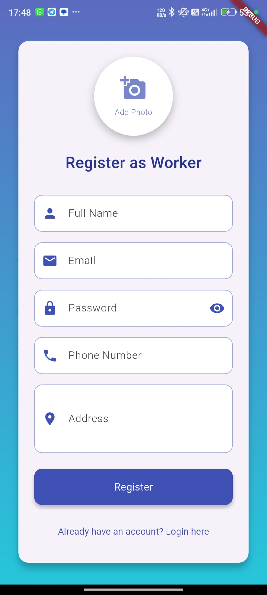
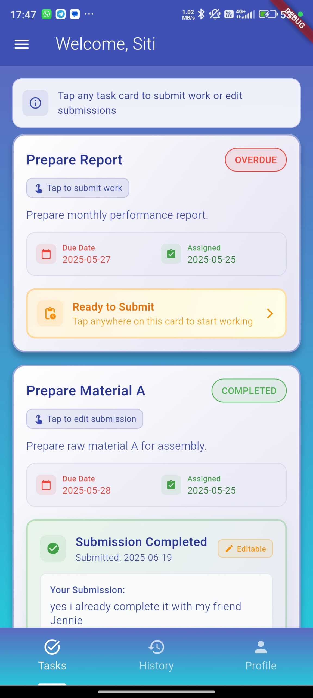
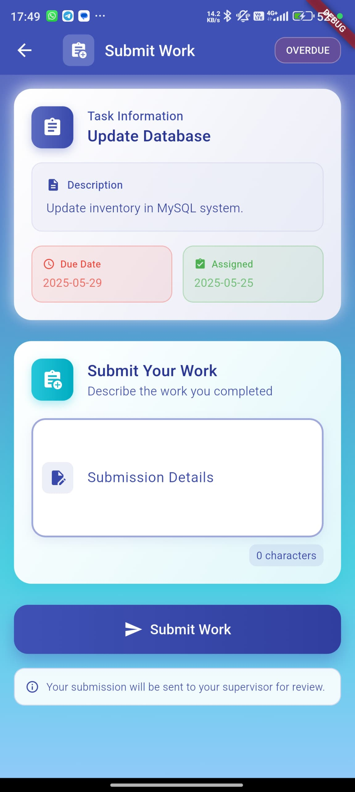
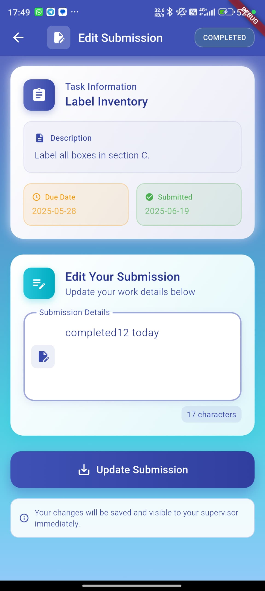
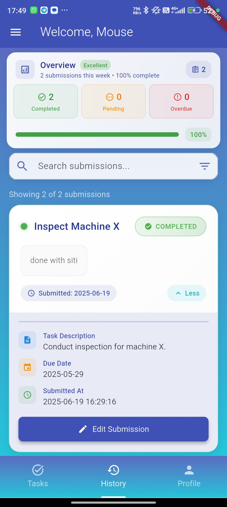
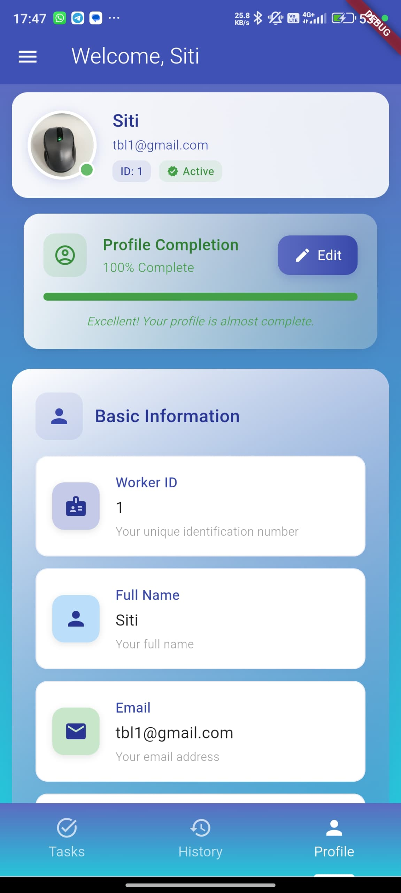
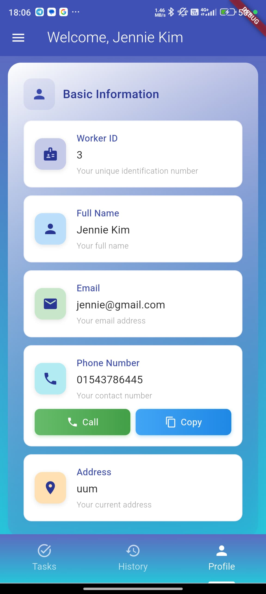
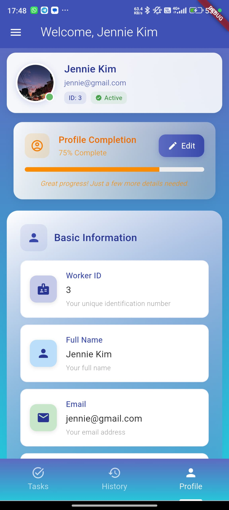
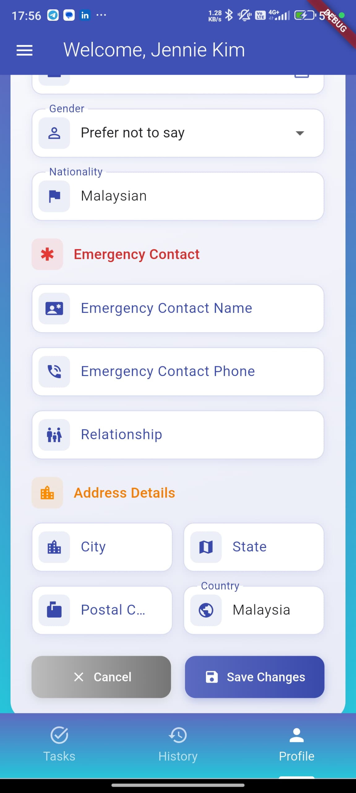

# Workers Tasks Management System

A Flutter application for managing worker tasks and profiles with interactive features.

## 🚀 Quick Start

### Prerequisites
- Flutter SDK (latest version)
- XAMPP (Apache + MySQL)
- Android Studio / VS Code

### 1. Setup Database
1. **Start XAMPP** - Launch Apache and MySQL services
2. **Open phpMyAdmin** - Go to `http://localhost/phpmyadmin`
3. **Create Database**:
   ```sql
   CREATE DATABASE workers_tasks_db;
   ```
4. **Import Base Tables** - Import `api/workers_tasks_db.sql`
5. **Add Personal Info Fields** - Run `api/add_personal_info_fields.sql`

### 2. Configure IP Address

#### **Find Your IP Address:**
- **Windows**: Open CMD → Type `ipconfig` → Look for IPv4 Address
- **Mac/Linux**: Open Terminal → Type `ifconfig` → Look for inet address
- **Example**: `192.168.1.100`

#### **Update App Configuration:**
1. Open `lib/config/app_config.dart`
2. Change the IP address:
   ```dart
   static const String baseUrl = 'http://YOUR_IP_ADDRESS';
   ```
3. **For different devices:**
   - **Android Emulator**: Use `10.0.2.2`
   - **Physical Device**: Use your computer's IP address
   - **iOS Simulator**: Use `localhost` or `127.0.0.1`

### 3. Setup Backend
1. **Copy API folder** to XAMPP's `htdocs` directory
2. **Update database connection** in `api/db_connection.php` if needed:
   ```php
   $servername = "localhost";
   $username = "root";
   $password = "";
   $dbname = "workers_tasks_db";
   ```

### 4. Install & Run App
```bash
# Install dependencies
flutter pub get

# Run the app
flutter run
```

## 📱 Key Features

### **Profile Management**
- **Interactive Edit** - Integrated edit button with profile completion
- **Phone Functionality** - Call and copy phone numbers directly
- **Progress Tracking** - Visual completion percentage
- **Personal Information** - Comprehensive worker details

### **Task Management**
- **Task Assignment** - View assigned tasks with status indicators
- **Work Submission** - Submit and edit work submissions
- **Submission History** - Complete tracking of all work submissions with timestamps
- **Status Tracking** - Pending, completed, overdue with auto-updates
- **Visual Indicators** - Color-coded status and progress

## 🔧 Configuration

### **API Endpoints**
All endpoints are configured in `lib/config/app_config.dart`:
- Login: `/api/login_worker.php`
- Registration: `/api/register_worker.php`
- Tasks: `/api/get_works.php`
- Profile: `/api/get_profile.php`
- Submit Work: `/api/submit_work.php`
- Edit Submission: `/api/edit_submission.php`
- Submission History: `/api/get_submission_history.php`

### **Database Tables**
- `tbl_workers` - Worker information and personal details
- `tbl_works` - Task assignments and details
- `tbl_submissions` - Work submissions and status

## 🛠️ Troubleshooting

### **Common Issues**
- **App can't connect**: Check IP address in `app_config.dart`
- **Database errors**: Ensure XAMPP services are running
- **Login fails**: Verify database connection and user data
- **Phone features not working**: Install dependencies with `flutter pub get`

### **Check Your Setup**
1. **XAMPP Status**: Apache and MySQL should be green/running
2. **Database**: `workers_tasks_db` should exist with all tables
3. **IP Address**: App config should match your computer's IP
4. **API Files**: Should be in `htdocs/api/` folder

## 📁 Project Structure

```
lib/
├── config/app_config.dart        # IP address and API endpoints
├── models/                       # Data models
├── screens/                      # App screens
└── main.dart                     # App entry point

api/
├── db_connection.php             # Database connection
├── *.php                         # API endpoints
└── *.sql                         # Database setup files
```

## 📸 Screenshots & Features Demo

> **Note**: Additional screenshots are available in the `outputImage/` folder

### **Authentication & Registration**
| Login Screen | Registration Screen |
|--------------|---------------------|
|  |  |
| Clean login interface with validation | Comprehensive registration with profile image |

### **Task Management**
| Task List | Submit Work | Edit Submission | Submission History |
|-----------|-------------|-----------------|-------------------|
|  |  |  |  |
| Color-coded task status indicators | Professional work submission interface | Easy submission editing | Complete submission tracking |

### **Enhanced Profile Features**
| Profile Overview | Profile Details | Profile Completion 75% | Edit Profile |
|------------------|-----------------|----------------------|------------------------|
|  |  |  |  |
| Integrated edit with completion tracking | Comprehensive personal information | Profile completion percentage | Interactive phone numbers and organized sections |

### **What You'll See in Each Screenshot**

#### **Login Page** 
- Clean, professional login interface
- Email and password validation
- Gradient background design
- "Remember me" functionality

#### **Registration Page** 
- Comprehensive worker registration form
- Profile image upload capability
- Real-time form validation
- Professional styling with animations

#### **Task List Page**
- Color-coded task status (Green/Orange/Red)
- Task cards with due dates and descriptions
- Pull-to-refresh functionality
- Interactive task selection

#### **Submit Work Page** 
- Rich text submission interface
- Character counter and validation
- Task information display
- Professional form design

#### **Edit Submission Page** 
- Pre-filled submission text
- Update confirmation dialogs
- Task details and status
- Success feedback messages

#### **Submission History Page** 
- Complete chronological list of all work submissions
- Task titles and submission dates with timestamps
- Submission status indicators (submitted, updated, reviewed)
- Search and filter functionality for easy navigation
- Detailed submission content preview
- Professional timeline layout with visual indicators

#### **Profile Pages** 
- **Top Section**: Profile completion progress with integrated edit button
- **Bottom Section**: Interactive phone numbers with call/copy buttons
- Organized information sections with color coding
- Personal details, emergency contacts, and address information

### **🎨 Visual Guide**

#### **Color Coding System**
- 🟢 **Green**: Completed tasks, success messages, call buttons
- 🟠 **Orange**: Pending tasks, progress indicators, warning states
- 🔴 **Red**: Overdue tasks, error messages, cancel buttons
- 🔵 **Blue**: Edit buttons, copy buttons, information sections
- 🟣 **Purple**: Personal information sections
- 🟡 **Yellow**: Emergency contact sections

#### **Interactive Elements**
- **📞 Phone Numbers**: Tap to call or copy to clipboard
- **✏️ Edit Button**: Integrated with profile completion card
- **📋 Task Cards**: Tap to submit work or edit submissions
- **🔄 Pull to Refresh**: Swipe down on task list to update
- **📊 Progress Bars**: Visual completion percentage tracking

### **Key UI Features Demonstrated**

#### **📱 Login & Registration**
- **Secure Authentication** - Clean login with email validation
- **Comprehensive Registration** - Profile image upload and form validation
- **Professional Design** - Modern gradient backgrounds and smooth animations

#### **📋 Task Management**
- **Visual Status Indicators** - Green (completed), Orange (pending), Red (overdue)
- **Interactive Task Cards** - Tap to submit work or edit submissions
- **Professional Forms** - Rich text editing with character counters
- **Submission History** - Complete chronological tracking of all work submissions
- **Timeline View** - Professional layout with timestamps and status indicators
- **Success Feedback** - Clear confirmation messages and smooth transitions

#### **👤 Enhanced Profile**
- **Integrated Edit Button** - Edit functionality built into completion card
- **Progress Tracking** - Real-time completion percentage with color coding
- **Interactive Phone Numbers** - Call and copy functionality for all phone fields
- **Organized Sections** - Color-coded information categories
- **Smart Display** - Only shows sections with actual data
- **Professional Layout** - Modern cards with gradients and shadows

## 🎯 Usage

### **First Time Setup**
1. Register a new worker account
2. Login with your credentials
3. Complete your profile information
4. View assigned tasks and submit work

### **Daily Use**
- **Check Tasks**: View pending, completed, and overdue tasks
- **Submit Work**: Complete tasks and submit your work
- **Edit Submissions**: Modify previously submitted work
- **View History**: Track all your work submissions with timestamps
- **Update Profile**: Keep your information current

## 📞 Support

If you encounter issues:
1. Check the troubleshooting section above
2. Verify your IP address configuration
3. Ensure XAMPP services are running (Apache & MySQL)
4. Check database connection settings

## 🔄 Updates

Recent improvements:
- ✅ Fixed submission editing issues
- ✅ Added phone call and copy functionality
- ✅ Enhanced profile completion tracking
- ✅ Improved error handling and user feedback

---

**Quick Setup Summary:**
1. Start XAMPP → Create database → Import SQL files
2. Find your IP address → Update `app_config.dart`
3. Copy API to htdocs → Run `flutter pub get` → Run app `flutter run`
